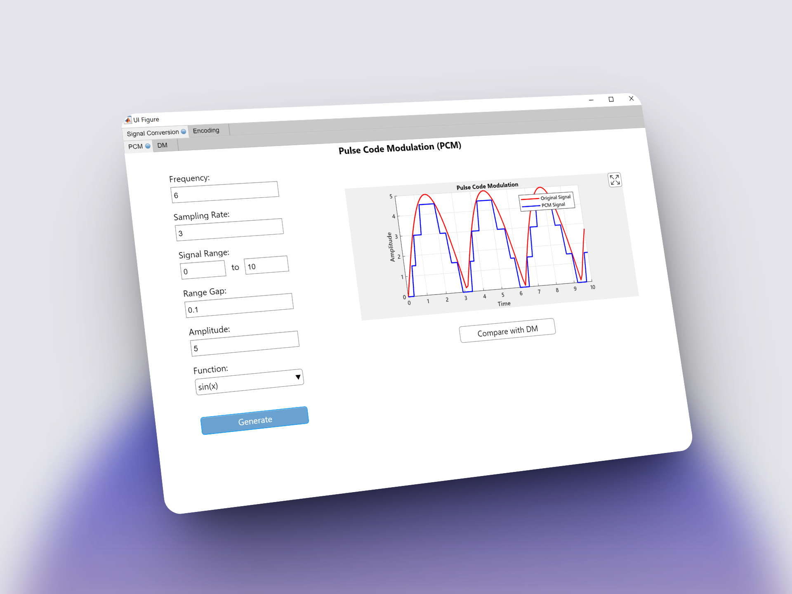
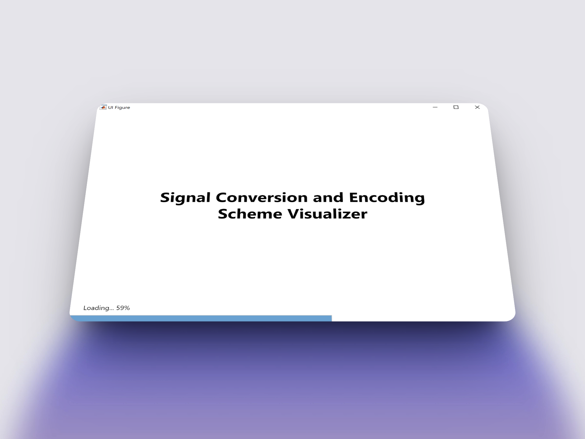
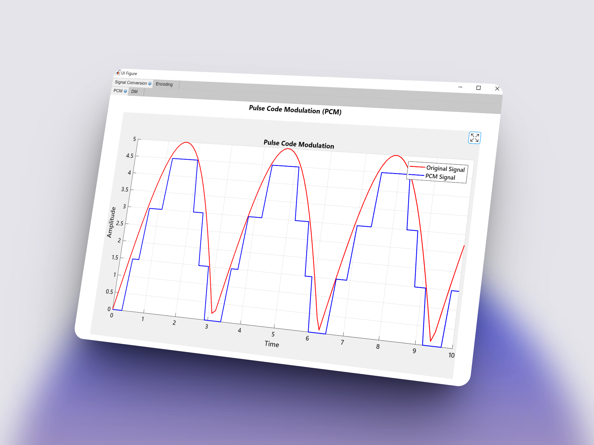
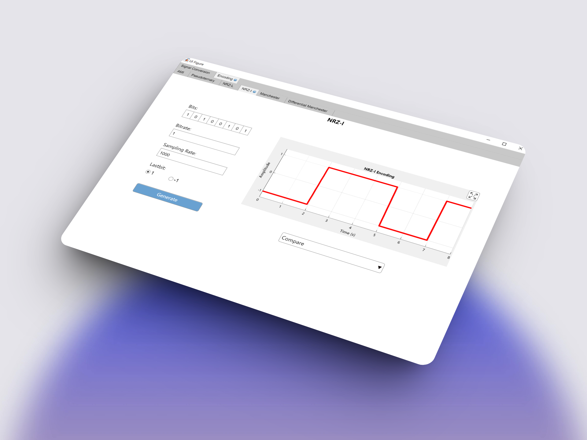
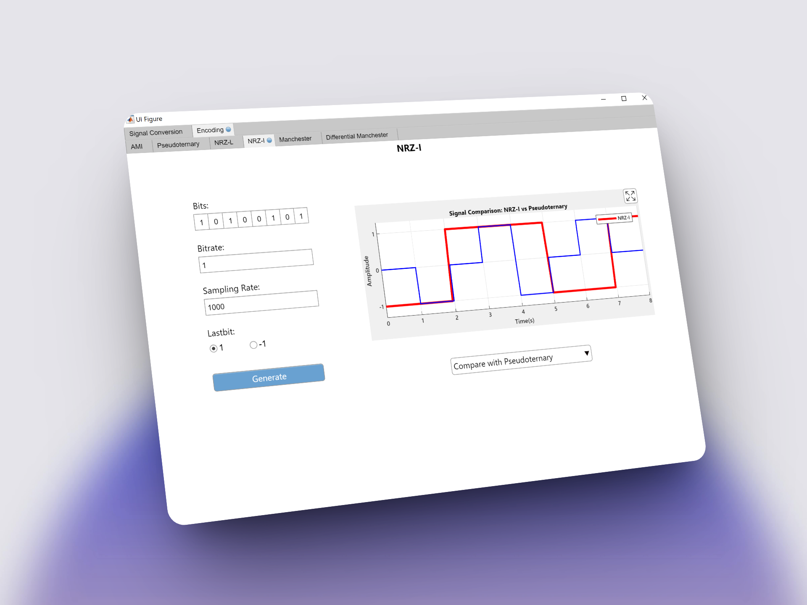

#  Signal Conversion and Encoding Scheme Visualizer

This MATLAB app performs **Digital-to-Analog-Conversion**, **Line Encoding**, and **Scheme Comparison**.

## 📷 Preview

<p align="center">
  
  
  
  
  
</p>

## ✨ Features

This MATLAB application provides a comprehensive suite of functionalities for analyzing digital-to-analog conversion and signal encoding. Key features include:

- **Digital-to-Analog Conversion:** Supports essential conversion techniques, including Pulse Code Modulation (PCM) and Delta Modulation (DM), enabling detailed examination of the conversion process.
- **Line Encoding Schemes:** Visualize and understand various line encoding techniques including:
  - AMI (Alternate Mark Inversion)
  - Pseudoternary
  - NRZ-L (Non-Return-to-Zero Level)
  - NRZ-I (Non-Return-to-Zero Inverted)
  - Manchester
  - Differential Manchester
- **Scheme Comparison:** Easily compare the waveforms of different encoding and conversion schemes side-by-side to grasp their unique characteristics.
- **Interactive Visualization:** Provides interactive plotting capabilities, allowing users to enlarge and inspect signal waveforms with high granularity for in-depth analysis.

## Setup Instructions

1. **Clone the Repository**:
   ```bash
   git clone https://github.com/taher-dev/Signal-Conversion-And-Encoding-Scheme-Visualizer-MATLAB.git
   ```
2. Launch **_SplashScreen.mlapp_**
